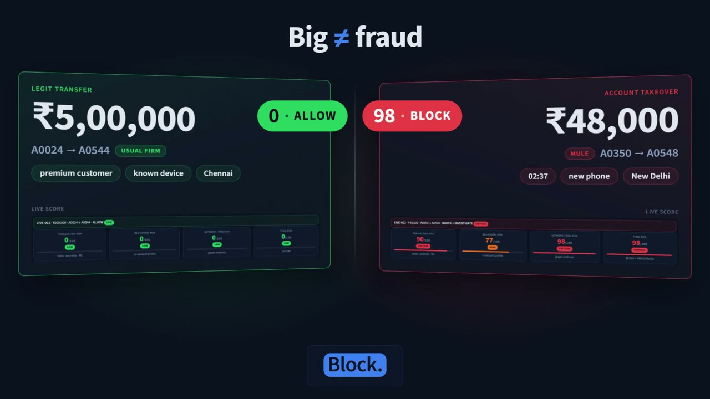

# Fraud Intelligence — HackNex 2026 (HNX26PSI04)

**An explainable, real-time financial fraud intelligence platform.** It scores every
transaction, account and fraud ring from 0 to 100, explains *why* in plain language, shows
*how* each entity is connected to others, and recommends *what to do*. It also deliberately
stays quiet on legitimate high-value activity.

> Traditional fraud detection asks: *Is this transaction fraudulent?*
> This platform asks: **Is it unusual? Why? Who is it connected to? Is it part of a
> coordinated fraud ring? What evidence supports the decision? What should the analyst do next?**

Everything runs locally on a laptop CPU. No external API, LLM or GPU is needed, and no
secrets are used.

## 🎬 Demo video (2 min)


https://github.com/user-attachments/assets/eab615c9-60c0-456b-b61a-1b977d89b66a


[](demo/fraud-intelligence-demo.mp4)

**[▶ Watch the demo video](demo/fraud-intelligence-demo.mp4)** (`demo/fraud-intelligence-demo.mp4`, 2:08, 1080p, with voice-over and captions).
It walks through the live monitor, a transaction investigation with all three risk scores,
the network graph, fraud ring FR-001, explainable AI, recommended actions, the
false-positive test (legit ₹5,00,000 → ALLOW vs ₹48,000 takeover → BLOCK), a sample
input → output, and the evaluation results. Every product shot is a real screen capture of
the running dashboard.

---

## Results at a glance

Each system is scored against hidden labels that the detector never reads (`eval/evaluate.py`).
A transaction counts as flagged when its final risk is 61 or more (HIGH or CRITICAL).

| Seed 2026 (development set, 41,147 transactions) | Precision | Recall | False alarms | ROC-AUC |
|---|---|---|---|---|
| **Combined system (all layers)** | **100%** | **100%** | **0** | **1.000** |
| Real-time rules only | 100% | 42% | 0 | – |
| Supervised ML only (p ≥ 0.5) | 74% | 89% | 96 | 0.999 |
| Isolation Forest only | 36% | 15% | 83 | 0.852 |
| Naive "flag the biggest 1% of amounts" | **0%** | **0%** | 412 | 0.668 |

- **Accounts:** all 38 fraud accounts caught, 0 innocent accounts flagged.
- **Rings:** all 4 planted rings recovered exactly (100% member overlap).
- **Legitimate look-alikes:** 0 false alarms out of 2,203. These are premium customers moving ₹2–6 lakh, businesses, travellers, households sharing a phone, rent paid to landlords, and occasional crypto buyers.

**Robustness on unseen data.** The same code was run on six more datasets generated with
seeds that were not used during development (`python eval/robustness.py`). The ML model
is trained on seeds 11 and 13, so none of these seeds were used in training.

| Seed | Precision | Recall | False alarms | Fraud accounts | Innocent flagged | Rings exact |
|---|---|---|---|---|---|---|
| 2026 (dev) | 1.000 | 1.000 | 0 | 38/38 | 0 | 4/4 |
| 7 | 1.000 | 1.000 | 0 | 38/38 | 0 | 4/4 |
| 42 | 1.000 | 1.000 | 0 | 38/38 | 0 | 4/4 |
| 99 | 1.000 | 0.987 | 0 | 38/38 | 0 | 4/4 |
| 123 | 1.000 | 0.997 | 0 | 38/38 | 0 | 4/4 |
| 314 | 1.000 | 0.997 | 0 | 38/38 | 0 | 4/4 |
| 777 | 1.000 | 0.986 | 0 | 38/38 | 0 | 4/4 |

> **Honest caveat:** this is synthetic data that we designed, so near-perfect scores show
> the method works on these patterns, not that it would match this on real bank data. The
> seeds 7 and 42 check did catch two real bugs: a rare-but-legitimate merchant mistaken for
> a collusive one, and "synthetic identity" status spreading across a merged ring. Both
> were fixed in the general logic, not tuned per seed.

---

## Architecture

```
                    TRANSACTION DATA  (synthetic · PaySim · IEEE-CIS · any CSV)
                           │
                  DATA PREPROCESSING          fraud/data_loader.py
             ┌─────────────┴─────────────┐
     TRANSACTION FEATURES        BEHAVIOR FEATURES
     fraud/stream.py             fraud/behavioral_analysis.py
     (real-time rules, past-only) (per-account profile deviation)
             └─────────────┬─────────────┘
                  ANOMALY DETECTION           fraud/anomaly_detection.py (Isolation Forest + LOF)
                    FRAUD ML MODEL            fraud/fraud_model.py (RF / GB / LR, trained on other seeds)
                  GRAPH CONSTRUCTION          fraud/network.py + fraud/graph_analysis.py
          Accounts · Devices · Merchants · Beneficiaries · Locations · Customers · Transactions
                  FRAUD RING DETECTOR         fraud/fraud_ring.py + temporal_analysis.py + fraud_dna.py
                     RISK ENGINE              fraud/risk_engine.py
        Transaction Risk · Behavioral/Account Risk · Ring/Network Risk → Final Risk
                   EXPLAINABLE AI             fraud/explainability.py (+ ML feature contributions)
                 ACTION RECOMMENDER           fraud/action_engine.py
                 STREAMLIT DASHBOARD          app.py + ui/
```

### How the scores are built (nothing is hidden)

| Score | Built from | Formula |
|---|---|---|
| **Transaction Risk (T)** | real-time rules, Isolation Forest, supervised ML | `100 × (1 − ∏(1 − wᵢ))` over named reasons |
| **Behavioral Risk (B)** | 7 deviations from the account's own profile | `Σ weight × deviation` (amount .22, device .18, location .14, time .14, velocity .12, merchant .10, beneficiary .10) |
| **Network Risk (N)** | ring evidence, fraudster-controlled accounts, links to risky accounts | ring risk, or a capped share of it |
| **Final Risk** | T, B, N | `0.45·T + 0.25·B + 0.30·N` (weights configurable in the sidebar or via `FRAUD_RISK_WEIGHTS`) |
| Guardrail | | A CRITICAL (≥ 81) T, or a CRITICAL N that rests on direct ring evidence, is never averaged away. Behavioral deviation alone can never trigger it. |
| **Account Risk** | top transaction, ring membership, mule behaviour, links | `100 × (1 − ∏(1 − wᵢ))` |
| **Ring Risk** | each kind of ring evidence | `100 × (1 − ∏(1 − w_k))`, shown kind by kind |

**Bands and actions** (decision support only):

| Band | Action | Meaning |
|---|---|---|
| 0–30 LOW | ALLOW | consistent with normal behaviour |
| 31–60 MEDIUM | MONITOR | keep watching the account |
| 61–80 HIGH | STEP-UP AUTHENTICATION | OTP / biometric verification |
| 81–100 CRITICAL | BLOCK + INVESTIGATE | temporarily block, investigate connected entities |

---

## Data pipeline (step by step)

How input data is collected, processed and passed through the system
(`python -m fraud.pipeline`, about 17 s for 41k transactions). Each step only uses
information available at the time of the transaction.

| # | Step | Module | Input → output |
|---|---|---|---|
| 1 | **Collect** | `data_gen/generate.py` or a CSV upload (`fraud/data_loader.adapt_external`) | synthetic generator, PaySim, IEEE-CIS or any CSV → `data/transactions.csv`, `accounts.csv`, `merchants.csv` |
| 2 | **Clean and enrich** | `fraud/data_loader.py` | fills missing values, maps unseen categories and accounts, adds account_age, transaction_frequency, historical_average_amount, previous_transaction_count, location, beneficiary_id |
| 3 | **Transaction features + real-time rules** | `fraud/stream.py` | events replayed in time order; 17 named rules (new device abroad, card-testing burst, structuring, mule pass-through …) and 17 numeric features per transaction |
| 4 | **Behavioural profile deviation** | `fraud/behavioral_analysis.py` | each transaction compared with the account's own past (amount, device, location, time, velocity, merchant, beneficiary) → Behavioral Risk |
| 5 | **Anomaly detection** | `fraud/anomaly_detection.py` | Isolation Forest + LOF fitted on the first 20 days ("normal") → anomaly percentile |
| 6 | **Supervised model** | `fraud/fraud_model.py` | Random Forest trained on separately generated labelled data (`models/fraud_model.pkl`) → fraud probability |
| 7 | **Graph construction** | `fraud/network.py`, `fraud/graph_analysis.py` | accounts linked by shared or controller devices, IP ranges, rare purchase sequences, mule beneficiaries, collusive merchants |
| 8 | **Fraud rings + time + DNA** | `fraud/fraud_ring.py`, `temporal_analysis.py`, `fraud_dna.py` | connected groups → rings scored on evidence, coordinated timing, behavioural similarity and fund velocity → `outputs/rings.json` |
| 9 | **Risk engine** | `fraud/risk_engine.py` | Transaction, Behavioral and Network Risk → Final Risk, band, account risk |
| 10 | **Explain and act** | `fraud/explainability.py`, `fraud/action_engine.py` | reasons, checklist, narrative, recommended action → `outputs/transaction_scores.csv.gz`, `outputs/account_scores.csv` |
| 11 | **Evaluate** | `eval/evaluate.py`, `eval/robustness.py` | outputs vs hidden labels → `eval/scorecard.json`, `eval/robustness.json` |
| 12 | **Present** | `app.py`, `ui/` | the dashboard reads `outputs/`; the live scorer (`fraud/live.py`) scores new transactions in milliseconds |

---

## Sample input and output

Two real rows from the committed dataset (`data/transactions.csv`) and what the system
produced for them (`outputs/transaction_scores.csv.gz`).

**Runnable samples:** the [`samples/`](samples/) folder has 4 real input rows
(`sample_input.csv`) and 3 brand-new transactions (`new_transactions.csv`) that are scored
live against the history. Run `python samples/run_samples.py` to regenerate
[`samples/sample_output.md`](samples/sample_output.md) and `samples/sample_output.json`, which
hold each input with its three risk scores, final risk, band, action, evidence and
explanation.

### Example 1: an ordinary-looking purchase that is part of a fraud ring

**Input**

```
txn_id     T030351
timestamp  2026-09-14 10:00:05
account    A0555        type  purchase      channel  online
merchant   M030 (GiftHub Digital)           amount   ₹4,759.64
device     D0662        ip    104.60.61.96  location Delhi, IN
```

**Output**

| Transaction Risk | Behavioral Risk | Network Risk | Weighted blend | **Final Risk** | Band | Action |
|---|---|---|---|---|---|---|
| 62 | 16 | 98 | 61 | **98** (guardrail: network evidence) | CRITICAL | **BLOCK + INVESTIGATE** |

Evidence (the reason codes stored with the transaction):

- `RING_EVIDENCE` (w 0.98): part of the evidence linking **FR-001** (11 accounts): same purchase sequence
- `ML_MODEL` (w 0.55): Random Forest trained on confirmed fraud cases rates this 91% likely to be fraud
- `FIRST_RISKY_CATEGORY` (w 0.15): first ever gift-card purchase on this account

Explanation generated by the system:

> T030351 is CRITICAL risk (98/100) because it is part of the evidence linking fraud ring
> FR-001 (11 accounts repeating the same purchase sequence, paying the same beneficiary,
> sharing devices), the amount is 3.7× the account's normal spending, and the ML model rates
> it 91% similar to confirmed fraud.

On its own, a ₹4,760 gift-card purchase looks normal (Behavioral Risk 16). The ring is what
gives it away: FR-001 (ring risk 98/100) has 10 of 10 accounts active within 14 minutes,
the same GiftHub → VoltX → CoinSwift sequence, 2 linked controller devices, one mule
beneficiary (A0548), and 91% behavioural similarity.

### Example 2: a ₹5.8 lakh transfer that is correctly allowed

**Input**

```
txn_id     T005934
timestamp  2026-08-09 16:49:30
account    A0086        type  transfer      channel  netbanking
payee      A0544        amount ₹5,84,304.14
device     D0101        location Pune, IN
```

**Output**

| Transaction Risk | Behavioral Risk | Network Risk | **Final Risk** | Band | Action |
|---|---|---|---|---|---|
| 5 | 9 | 0 | **5** | LOW | **ALLOW** |

> T005934 is LOW risk (5/100). … High amount alone is insufficient evidence: ₹584,304
> matches context (this account's comparable transactions average ₹104,618; known device
> and beneficiary patterns).

**Try it live:** in the dashboard's *Live Transaction Monitor → Scenario Lab*,
**✅ Legit ₹5,00,000** scores 0 → ALLOW, and **🚨 ₹48,000 account takeover** (02:37, new
device, New Delhi, mule beneficiary) scores 98 → BLOCK + INVESTIGATE. Each comes with the
formula, the checklist and the explanation.

---

## What makes it more than a classifier

| Innovation | How it works |
|---|---|
| **Fraud Ring Intelligence** | Accounts are linked by strong evidence: a shared device among new accounts, a controller device new to several established accounts, a shared IP range, the same rare purchase sequence, a common mule beneficiary, or a collusive merchant. Connected components become rings, which are then scored and explained. |
| **Fraud DNA** | A behavioural fingerprint (amount, time, device, location, merchant, velocity, network, sequence) built from each account's incident window, compared by cosine similarity. The demo ring's members are 91% similar despite different cities and phones. |
| **Temporal Pattern Detection** | Configurable 5 min / 15 min / 30 min / 1 h / 24 h windows. Example output: *"10 accounts performed similar transactions at GiftHub Digital, VoltX Gadgets, CoinSwift Exchange within a 32-minute window and transferred funds to the same beneficiary."* Business beneficiaries such as landlords are marked as benign hubs. |
| **Explainable Risk Scoring** | A "WHY WAS THIS FLAGGED?" checklist, a plain-English narrative, a noisy-OR waterfall, and ML feature contributions (SHAP if installed, otherwise an exact model-agnostic baseline-substitution method). |
| **Multi-Level Risk** | Transaction, behavioral and network scores, plus account risk and ring risk. |
| **Context-Aware False-Positive Prevention** | Amounts are compared with the account's own history of the same transaction type. A profile only learns from transactions once they are 24 h old, so an attacker cannot "teach" it. Businesses adding suppliers, landlords collecting rent and household phones are handled explicitly. |
| **Real-Time Simulation** | Every score uses only past data. The live scorer replays history once, then scores a new event in milliseconds without changing state. |
| **Recommended Response Engine** | Transaction, account and ring playbooks: freeze the payout pathway, investigate linked accounts, review shared devices and beneficiaries, and escalate. |

---

## Dataset

`python data_gen/generate.py` creates a fictional INR dataset: 568 accounts, about 41,000
transactions over 60 days. The detector reads only `data/transactions.csv`,
`data/accounts.csv` and `data/merchants.csv`; labels live in `eval/`.
`data/synthetic_data.csv` is a flat, labelled export with every spec field (transaction_id,
customer_id, merchant_category, location, payment_channel, beneficiary_id, account_age,
transaction_frequency, historical_average_amount, previous_transaction_count, is_fraud).
The pipeline never reads it.

| Planted fraud (10 scenarios from the brief) | How it is generated |
|---|---|
| Coordinated fraud ring (**demo ring**) | 10 accounts in 8 cities on different phones buy gift card → electronics → crypto within ~50 minutes, then all pay one mule. Six of them send the transfer from 2 "controller" phones. |
| Multiple accounts on the same device | Device farm: 8 new accounts on 2 phones and one IP range, paying a mule |
| Account takeover / unusual location + device | New phone, foreign IP, 1–4 am, gift cards, electronics, transfer to a mule |
| Rapid transaction bursts | Card testing: ₹1–10 bursts at one merchant, then a large purchase |
| Many accounts → same beneficiary | 3 mules that collect and pass money to crypto within hours |
| Coordinated merchant fraud | 6 accounts push round-amount purchases through a newly onboarded fake merchant in late-night bursts |
| Structuring / splitting | 4–6 transfers of ₹45–50k within 48 h, just under ₹50,000 |
| Single-account fraud | Card testing and account takeover victims |
| **Legitimate high-value** | Premium customers moving ₹2–6 lakh weekly to the same firms, one-off ₹40k–1.4L purchases, businesses |

**Real datasets.** Upload a CSV in the sidebar (Data source). `fraud/data_loader.adapt_external`
recognises **PaySim / Kaggle financial fraud** (`step,type,amount,nameOrig,nameDest,isFraud`),
**IEEE-CIS** (`TransactionDT,TransactionAmt,card1,…,isFraud`), and generic files by column
name. Missing values, unseen categories, a single transaction, and data with no rings are all
handled. The ML model is pretrained on synthetic data, so expect domain shift on real data.

---

## Dashboard (11 pages)

1. **Executive Dashboard**: 10 KPI cards (transactions, frauds, rings, accounts, high-risk, critical, FPR, precision, recall, F1), ring alert banner, false-positive protection banner, risk distribution, fraud vs legitimate, risk over time, rings, geography, channels, innovations
2. **Live Transaction Monitor**: auto-refreshing stream replay (jump to "⚡ FR-001 attack"), live alerts, plus a **Scenario Lab** that scores new transactions in real time
3. **Transaction Investigation**: details → Transaction / Behavioral / Network / Final scores and formula → WHY checklist → ranked evidence waterfall → behavioural deviation → ML drivers → connected entities and mini-graph → action
4. **Account Intelligence**: account risk, profile, timeline and risk evolution, history, network, Fraud DNA, ring membership
5. **Fraud Ring Detection**: ring risk and evidence breakdown, ring graph, temporal sequence, DNA similarity heatmap, response playbook
6. **Network Graph**: interactive heterogeneous graph (zoom, pan, click a node for details, type and risk filters, Louvain suspicious clusters, risk propagation)
7. **Behavioral Analysis**: profile vs new transaction, Fraud DNA, temporal windows
8. **Explainable AI**: global importance, evidence frequencies, what decided each score, local explanations
9. **Alerts & Actions**: ring, account and transaction queues, analyst dispositions, CSV export
10. **Model Performance**: threshold slider, confusion matrix, ROC and PR curves, layer comparison, recall by pattern, look-alike false alarms, rings, robustness, model card
11. **Demo Guide**: the judging walkthrough with one-click navigation

Investigation flows across pages: Transaction → Account → Network → Ring → Action.

## Demo flow (3–5 minutes)

1. **Executive Dashboard**: transactions, alerts, 4 rings, precision/recall, the red FR-001 banner.
2. **Live Monitor**: choose *⚡ FR-001 attack* and press **▶ Stream live**. Normal transactions flow, then BLOCK alerts fire.
3. Click **Open investigation** on a red alert: T / B / N / Final scores, the formula, and the WHY checklist.
4. **Open account**: profile, timeline, risk evolution, connected suspicious accounts.
5. **Network Graph**: the account's devices, merchants, the mule beneficiary, and other accounts.
6. **Fraud Ring Detection**: FR-001, ring risk 98/100, 11 accounts, evidence breakdown.
7. **Temporal sequence** on the ring page: 10 of 10 accounts active within 14 minutes, same steps, same beneficiary.
8. **Explainable AI**: evidence weights, ML feature contributions, the exact formula.
9. **Alerts & Actions**: BLOCK + INVESTIGATE and the ring playbook (decision support).
10. **False-positive control**: in the Scenario Lab, click **✅ Legit ₹5,00,000** and it scores **0/100 → ALLOW**, because it matches the premium customer's normal transfers. Then click **🚨 ₹48,000 account takeover** (02:37, new device, New Delhi, mule beneficiary) and it scores **98/100 → BLOCK + INVESTIGATE**.

---

## Setup

```bash
python -m venv .venv
.venv\Scripts\activate                  # Windows   (source .venv/bin/activate on macOS/Linux)
pip install -r requirements.txt

python data_gen/generate.py             # dataset (DATA_SEED=7 for an unseen variant)
python -m fraud.fraud_model             # train the ML model on seeds 11 & 13 → models/
python -m fraud.pipeline                # score everything → outputs/   (~20 s)
python eval/evaluate.py                 # scorecard vs hidden labels → eval/scorecard.json
python eval/robustness.py               # 7 seeds, in memory → eval/robustness.json
python report.py                        # readable summary in the terminal
streamlit run app.py                    # dashboard
python -m unittest discover tests       # unit tests + dashboard smoke tests
```

`data/`, `models/` and `outputs/` are committed, so `streamlit run app.py` works straight
after `pip install`. If `outputs/` is missing, the app builds it on first start.

### Configuration (environment variables, all optional)

| Variable | Default | Meaning |
|---|---|---|
| `FRAUD_RISK_WEIGHTS` | `0.45,0.25,0.30` | default T, B, N weights |
| `FRAUD_BASELINE_DAYS` | `20` | "normal" period for the anomaly model |
| `FRAUD_TRAIN_SEEDS` | `11,13` | datasets used to train the ML model |
| `FRAUD_MAX_UPLOAD_ROWS` | `60000` | row cap for uploaded CSVs |
| `DATA_SEED` | `2026` | generator seed |

## Deploy to Streamlit Community Cloud

1. Push this repository to GitHub, including `data/`, `models/`, `outputs/` and `eval/`.
2. Go to [share.streamlit.io](https://share.streamlit.io), choose **New app**, pick the repo and branch, and set the main file to `app.py`.
3. Under **Advanced settings**, select Python 3.12. No secrets are needed.
4. Deploy. `.streamlit/config.toml` sets the dark theme and headless mode. If the ML pickle cannot be read by the cloud's scikit-learn version, the app retrains it once (~40 s) and caches it.

## Project structure

```
app.py                       Streamlit entry point (navigation, sidebar weights, upload)
ui/state.py                  data loading, live weight application, cached graphs/scorer
ui/components.py             theme, KPI cards, score cards, checklist, network figure
ui/nav.py                    cross-page investigation workflow
ui/pages/*.py                the 11 pages
fraud/config.py              weights, bands, windows (env-overridable)
fraud/data_loader.py         load / clean / enrich; PaySim, IEEE-CIS and generic adapters
fraud/stream.py              real-time rule engine (causal, incremental, what-if `peek`)
fraud/behavioral_analysis.py behavioural profiles and 7-dimension deviation
fraud/anomaly_detection.py   Isolation Forest + LOF
fraud/fraud_model.py         supervised model training, selection, contributions
fraud/network.py             account evidence graph and ring components
fraud/fraud_ring.py          ring scoring, temporal/DNA/fund-flow evidence, playbooks
fraud/graph_analysis.py      heterogeneous entity graph, communities, risk propagation
fraud/temporal_analysis.py   time-window coordination detection
fraud/fraud_dna.py           behavioural fingerprints and similarity
fraud/risk_engine.py         three scores → final score, bands, guardrail
fraud/explainability.py      checklist, narratives, waterfall, FP-protection notes
fraud/action_engine.py       transaction / account / ring recommendations
fraud/live.py                live single-transaction scoring
fraud/pipeline.py            orchestration → outputs/
data_gen/generate.py         synthetic data with 10 fraud scenarios and benign look-alikes
eval/evaluate.py             scorecard vs hidden labels;  eval/robustness.py  unseen seeds
tests/                       unit tests and dashboard smoke tests
samples/                     sample input → output (run_samples.py, inputs, generated outputs)
demo/                        2-minute demo video + thumbnail
```

## Scope note

**Minimum viable solution (implemented)**

- Synthetic transaction dataset with planted fraud and hidden labels
- Real-time transaction risk scoring (0–100) with named reasons, using only past data
- Behavioural profile per account, with deviation scoring
- Detection of at least one coordinated fraud ring through graph analysis
- Transaction, account and ring risk with LOW / MEDIUM / HIGH / CRITICAL bands
- Recommended actions (ALLOW · MONITOR · STEP-UP · BLOCK + INVESTIGATE)
- False-positive protection for legitimate high-value activity
- Evaluation against hidden labels (precision, recall, F1, FPR, ROC-AUC)
- A Streamlit dashboard to run and demonstrate the system

**Stretch goals (also implemented)**

- 10 fraud scenarios including collusive merchants, structuring and a demo ring with controller devices; 7 kinds of legitimate look-alikes
- Supervised ML model trained on *separate* datasets (no leakage), with RF / GB / LR comparison and per-feature contributions
- Isolation Forest + LOF anomaly detection
- Heterogeneous entity graph with an interactive view, Louvain clusters and risk propagation
- Temporal coordination detection with configurable 5 min – 24 h windows
- Fraud DNA behavioural fingerprints and similarity
- Configurable risk weights with a transparent guardrail
- Live stream replay and a Scenario Lab for scoring new transactions in real time
- Upload of real datasets (PaySim, IEEE-CIS, generic CSV)
- Robustness on 6 unseen datasets; unit tests and dashboard smoke tests

**Not attempted / future work**

- Validation on real bank data with real labels
- Learning the rule weights from data instead of setting them by hand
- Streaming infrastructure (Kafka etc.) and re-running the network layer on every event
- A feedback loop that retrains on analyst dispositions

## Live demonstration

- **Locally:** `streamlit run app.py`, then follow the *Demo flow* above or the in-app **Demo Guide** page.
- **Hosted:** deploy to Streamlit Community Cloud (see above) and share the URL.
- **Recorded demo:** [demo/fraud-intelligence-demo.mp4](demo/fraud-intelligence-demo.mp4) (2:08, 1080p, voice-over + captions).

## Limitations

- Rule weights and thresholds are set by hand from known fraud patterns. The ML model and anomaly detector add learned signals, but the rules are not learned end to end.
- The data is synthetic and we designed it. Real data will have noisier labels and patterns we did not plant; the anomaly model and ML model are the fallback for those.
- The network layer runs in batches (about 20 s for 41k transactions). Live scoring uses the network context from the latest batch.
- Recommendations are decision support. Nothing blocks a payment or freezes an account unless it is integrated into an authorised banking system.

## Resources

Python 3.12 · pandas · NumPy · scikit-learn · NetworkX · Plotly · Streamlit. All data is
synthetic and fictional. AI coding assistance (Claude Code) was used during development.
